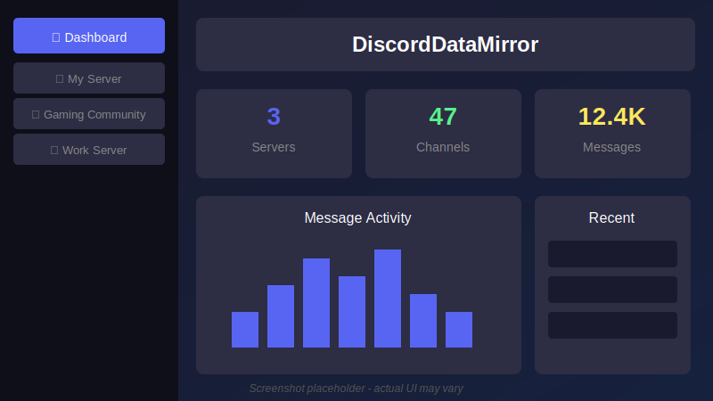
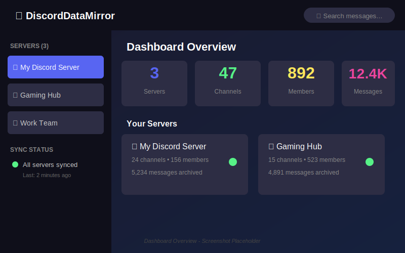
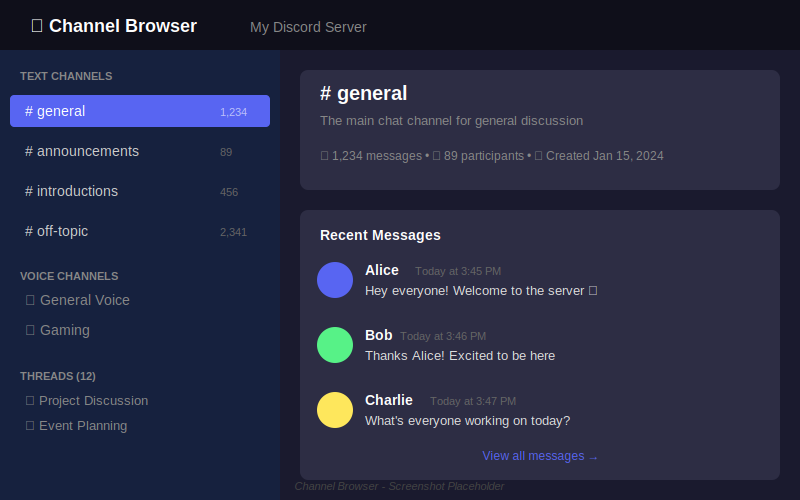
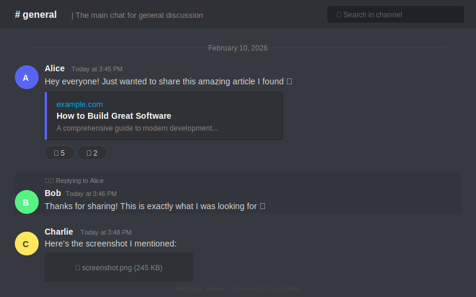
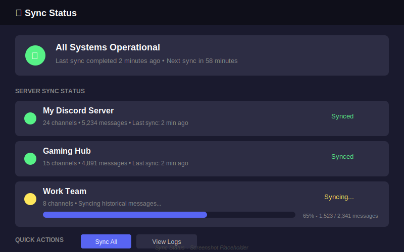

# DiscordDataMirror Documentation

Welcome to the official documentation for **DiscordDataMirror** — a powerful, open-source solution for monitoring, archiving, and exploring Discord server data.

## What is DiscordDataMirror?

DiscordDataMirror is a self-hosted application that creates a complete, searchable backup of your Discord servers. It runs as a background service, continuously monitoring and recording:

- 📝 **Messages** — Every message, edit, and deletion
- 👥 **Members** — User profiles, nicknames, roles, and join history  
- 📁 **Channels** — Text, voice, forums, threads, and categories
- 🎭 **Roles** — Permissions, colors, and hierarchies
- 📎 **Attachments** — Images, files, and embeds (with optional local caching)
- 💬 **Reactions** — Who reacted with what emoji
- 🧵 **Threads** — Archived and active thread content

All data is stored in PostgreSQL and accessible through a beautiful Blazor dashboard.

## Who Is This For?

### 🏢 Community Managers & Server Admins
Preserve your community's history. Never lose important discussions, announcements, or memories when Discord's retention limits kick in or when users delete their messages.

### 🔬 Researchers & Analysts
Study Discord communities with full historical data access. Export messages for sentiment analysis, activity patterns, or community health metrics.

### 🛡️ Moderation Teams
Track deleted messages and user behavior across time. Maintain an audit trail for moderation decisions.

### 💾 Data Archivists
Create complete backups of Discord servers for long-term preservation. Protect against data loss from server deletions or Discord policy changes.

### 👨‍💻 Developers
Learn from a production-quality .NET Aspire application with Domain-Driven Design, CQRS, and clean architecture patterns.

## Key Features

| Feature | Description |
|---------|-------------|
| **Real-time Sync** | Messages are captured instantly via Discord's gateway API |
| **Historical Backfill** | Initial sync fetches all accessible message history |
| **Full-text Search** | Find any message across all servers instantly |
| **User Tracking** | See a user's activity across all monitored servers |
| **Thread Support** | Captures ephemeral and archived thread content |
| **Attachment Caching** | Optionally download and store attachments locally |
| **Cross-Server Identity** | Link the same person across different accounts |
| **Modern Dashboard** | Clean, Discord-like interface for browsing data |
| **Docker Ready** | Deploy anywhere with Docker Compose |
| **.NET Aspire** | Built-in observability, health checks, and service discovery |

## Quick Links

- [🚀 Getting Started](guides/getting-started.md) — Set up DiscordDataMirror in 10 minutes
- [⚙️ Configuration](guides/configuration.md) — All configuration options explained
- [🤖 Bot Setup](BOT_SETUP.md) — Create and configure your Discord bot
- [🐳 Deployment](DEPLOYMENT.md) — Production deployment with Docker
- [❓ FAQ](guides/faq.md) — Frequently asked questions
- [🔧 Troubleshooting](guides/troubleshooting.md) — Common issues and solutions

## Screenshots

### Dashboard Overview

### Channel Browser

### Message Viewer

### Sync Status

## Technology Stack

- **.NET 10** — Latest .NET runtime
- **Aspire 13.1** — Cloud-native orchestration and observability
- **Blazor Server** — Real-time reactive UI
- **PostgreSQL 17** — Reliable, scalable database
- **Discord.Net** — Official Discord API wrapper
- **MediatR** — CQRS and pipeline behaviors
- **Entity Framework Core** — Database ORM
- **MudBlazor** — Material Design components

## License

DiscordDataMirror is open source under the [MIT License](https://github.com/JerrettDavis/DiscordDataMirror/blob/main/LICENSE).

## Support

- 🐛 [Report Issues](https://github.com/JerrettDavis/DiscordDataMirror/issues)
- 💬 [Discussions](https://github.com/JerrettDavis/DiscordDataMirror/discussions)
- ⭐ [Star on GitHub](https://github.com/JerrettDavis/DiscordDataMirror)
